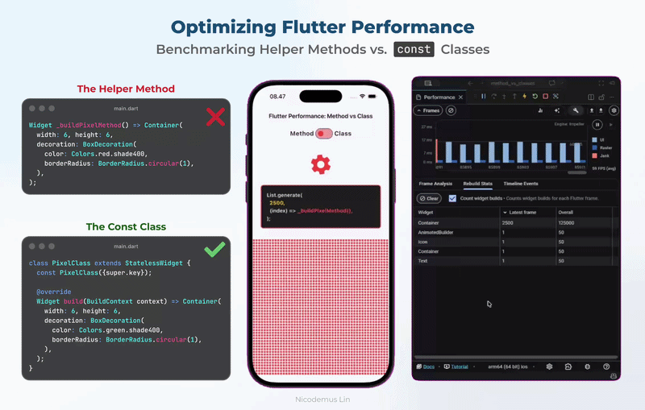

# Flutter Performance: Helper Methods vs. Const Classes

A simple benchmark project to visualize how **Helper Methods** can lead to Garbage Collector (GC) overload and UI jank compared to **Const Classes**.

## The Problem

When we use a helper method like `_buildWidget()`, Flutter has to execute that function and allocate brand new memory for every single widget returned, every single time the parent re-builds.

In this benchmark, we render **2,500 widgets**.

- **Method Mode:** Creates 2,500 new objects 60 times a second. This spikes the UI thread and causes visible stuttering.
- **Class Mode:** Uses `const` widgets. Flutter allocates the memory **once** and reuses the same reference, resulting in 0ms build time for those widgets during re-renders.

## Benchmark Visualization

## How to test

1. Run the app in **Profile Mode** (`flutter run --profile`). Performance issues are hard to see in Debug mode.
2. Open the **Flutter DevTools** -> **Performance** tab.
3. Toggle between "Method" and "Class" in the app.
4. Observe the **Blue Bars** (UI Thread) and the **Rebuild Stats** in DevTools.

## Visualizing the Jank

In the "Method" state, you will notice:

- Tall blue bars in the frame chart (exceeding the 16ms budget).
- High number of "Rebuilds" in the Rebuild Stats tab.
- The spinning gear animation will visibly stutter or "lag."

## Why this happens?

> "Classes have a better default behaviour. The only benefit of methods is having to write a tiny bit less code. There's no functional benefit." — **Remi Rousselet** (Creator of Riverpod/Provider)

By using `const` classes, you enable Flutter's **canonicalization**, which allows the engine to skip the build phase for those widgets entirely if they haven't changed.

## 🤝 Contributing & Learning Together

I built this simple benchmark to see the difference for myself, but there is always more to learn!

If you have ideas to make this test more accurate, find another performance "trap", or just want to improve the UI:

- **Feel free to contribute:** Send a PR or submit an issue.
- **Let's discuss:** If you find something interesting in the DevTools while running this, I'd love to hear about it.

Let's learn together and build smoother Flutter apps! 🚀

## Requirements

- Flutter SDK
- A device/emulator (Profile mode strongly recommended)

## 👨‍💻 Author

### **Nicodemus Lin**

_Mobile Engineer | Flutter Specialist | Full-Stack Engineer_

---

_Benchmark recorded using Flutter 3.41.7 • Dart 3.11.5 • DevTools 2.54.2_
